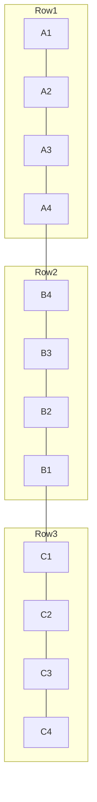
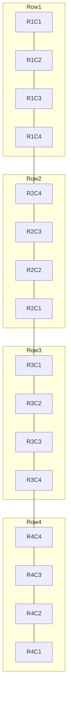

# Drimit Link – Open Standard
## **Annex A: Base Plate Standard – Distributed Matrix Backplane (v1.0)**

**Applies to:** DL-CS 1.0  
**Scope:** Passive base plates (a.k.a. backplanes) using the DL-CS 3×3 pogo slot and a matrix arrangement of tiles (25×25 mm).  
**Status:** Draft  
**License:** CERN-OHL-P v2 (Permissive)  

---

## 1. Purpose and Design Goals

This annex specifies the **base plate** (a.k.a. **backplane** or **motherboard**) for **matrix-arranged DL-CS slots**. It standardizes how multiple DL-CS modules are **mechanically placed** and **electrically interconnected** through a **passive bus** so that any compliant module—host or client—can dock in any slot and immediately communicate over **High-Speed CAN** and receive **power** safely.

**Goals:**

1. **Passive distributed bus:** no active components required on the base plate; all logic resides in modules.  
2. **Linear CAN topology:** a single continuous trunk with **no star branches**; slot taps act as **short stubs** (≤ 10 mm).  
3. **Reversible modules:** the base plate does not need to know the module orientation; DL-CS Gray 2-bit + module crosspoint guarantees signal order.  
4. **Scalable matrix:** slots arranged on a 25 mm grid, supporting small plates (2×2) to large matrices (e.g., 6×6+).  
5. **Hot-plug robustness:** ground-first contact, surge-limited power rails, and ESD/EMI control.

> **Non-goals:** This annex does not define higher-layer CAN protocols, addressing, or user interface schemas.


---

## 2. Normative Terminology

- **MUST / MUST NOT**: Mandatory for DL-CS base-plate compliance.  
- **SHOULD / SHOULD NOT**: Strongly recommended best practice; permissible to deviate with justification.  
- **MAY**: Optional.


---

## 3. Mechanical Specification

### 3.1 Slot Grid and Coordinates

- **Tile pitch:** **25.0 mm × 25.0 mm** center-to-center (nominal).  
- **Slot origin:** each slot is centered at its tile origin `(x = n·25, y = m·25)` in millimeters.  
- **PCB thickness:** **1.6 mm FR‑4** (nominal).  
- **Per-slot mechanical:** as per DL-CS 1.0 (pogo 3×3 centered, magnets at R=6.5 mm, screws at ±9.5 mm).

**Tolerances (unless otherwise noted):**

| Feature | Tolerance |
|---|---|
| Slot XY position | ± 0.10 mm |
| Slot rotation | ± 0.5° |
| Overall plate dimensions | ± 0.20 mm |
| Planarity across active area | ± 0.15 mm |
| Pogo/magnet coplanarity vs slot datum | per DL-CS 1.0 (§5.4) |

> **MUST:** Keep a **copper keepout** of ≥ **0.5 mm** around each screw hole pad to avoid accidental chassis shorts.


### 3.2 Fiducials and DFM

- **MUST:** Place **global fiducials** (≥ 2, opposite corners) and **local per-slot fiducials** (1 per 2×2 block) for assembly alignment.  
- **SHOULD:** Mark each slot index (e.g., `R3C5`) in silkscreen for inventory and testing.  
- **MAY:** Include solderable **bonding pad** tied to GND near one screw for chassis bonding.


### 3.3 Mounting and Enclosures

- **SHOULD:** Provide edge mounting holes (M3 or M4) outside the slot matrix for enclosure integration.  
- **SHOULD:** Use **non-magnetic** fasteners in and around the active slot field.  
- **MAY:** Employ a **steel back-plate** (back-iron) beneath magnets to increase retention, with electrical isolation from circuitry.


---

## 4. Electrical Topology

### 4.1 Overview

A compliant base plate implements:
- A **single continuous High‑Speed CAN trunk** (120 Ω differential characteristic impedance) routed across the matrix, with **short taps** to each slot’s S1/S2 pads (stub ≤ **10 mm**).  
- A **power rail V+** distributed to each slot (recommended: 12 V nominal), protected per slot (eFuse/limiter) or centrally.  
- A **solid ground plane** spanning the entire active area.  
- **ID1 / ID2 orientation networks** replicated per slot to provide Gray code (00/01/11/10) per DL‑CS 1.0.


### 4.2 Linear Trunk Patterns (Matrix-Friendly)

To avoid stars, the trunk MUST be **topologically linear**. Two canonical patterns are defined:

**Pattern A – Serpentine trunk (recommended for matrices ≥ 3×N):**  
The trunk snakes left-to-right, then right-to-left across consecutive rows.



**Pattern B – Perimeter loop with single linear chord (advanced):**  
Route a perimeter loop and **open** one vertex to form a line, or add a **single chord** to convert the loop into a line. Use **jumpers** or **0‑Ω links** to select path ends during assembly.


### 4.3 Termination

- **MUST:** Place **CAN termination only at the two ends** of the linear trunk.  
- **SHOULD:** Use **split termination** (60.4 Ω + 60.4 Ω to Vref_mid; 4.7–47 nF from Vref_mid to GND).  
- **MAY:** Provide **jumper blocks / DIP switches** at several perimeter locations to select which plates edges host the terminators.

```
CANH ──60.4 Ω──┐
                │
               4.7 nF
                │
CANL ──60.4 Ω──┘──► GND
```


### 4.4 Slot Taps (Stubs)

- **MUST:** Stub length from trunk to each slot’s **S1 (E)** and **S2 (W)** pads ≤ **10 mm** (target ≤ 5 mm).  
- **SHOULD:** Symmetric and length-matched (ΔL ≤ 0.5 mm).  
- **SHOULD:** Keep stubs on the same layer as trunk routing or use blind vias to minimize via stubs.


### 4.5 ID1 / ID2 Orientation Networks

Each slot MUST implement the Gray 2‑bit orientation network as in DL‑CS 1.0. The mapping is replicated per slot:

- **ID1 pads** (slot-relative NW/NE/SE/SW): `NW=0 (PD)`, `NE=0 (PD)`, `SE=1 (PU)`, `SW=1 (PU)`.  
- **ID2 pads** (slot-relative N/E/S/W): `N=0 (PD)`, `E=1 (PU)`, `S=1 (PU)`, `W=0 (PD)`.

**Recommended values (per pad):** `47–100 kΩ` to **VREF_H (3.3 V)** for pull‑ups, and to **GND** for pull‑downs.  
**ESD note:** A small **series resistor (100–330 Ω)** between each pad and the resistor network is RECOMMENDED.


### 4.6 Power Rail (V+) and Per-Slot Protection

- **V+ nominal:** 12 V DC (5–12 V allowable per DL‑CS 1.0).  
- **Distribution:** wide copper pours/tracks; see § 6 for sizing guidance.  
- **Per-slot protection (RECOMMENDED):**  
  - **eFuse / limiter** (0.5–1.5 A), with fault flag pads (test points).  
  - **TVS diode** on V+.  
  - **Ferrite bead** on V+ at slot entry (≥ 600 Ω @ 100 MHz).

**Alternative:** centralized eFuse per segment; ensure no single fault can collapse the entire bus.


### 4.7 Grounding & Planes

- **MUST:** Continuous **GND plane** across the slot matrix.  
- **SHOULD:** Via stitching around the CAN trunk (pitch 2–3 mm).  
- **MAY:** Chassis bonding via one screw hole **bond pad** and RC/λ filter if required by EMC strategy.


---

## 5. Routing Rules (Normative)

| Rule | Requirement | Rationale |
|---|---|---|
| R1 | CAN trunk 120 Ω ±10% differential | Signal integrity |
| R2 | No star branches; linear topology only | Deterministic reflections |
| R3 | Stub ≤ 10 mm (target ≤ 5 mm) | HS-CAN stability |
| R4 | Length-match CANH/CANL ΔL ≤ 0.5 mm | Minimize skew |
| R5 | Keep TVS/CMC close to slot pads | ESD/EMI control |
| R6 | Separate CAN pair from V+ by ≥ 1.0 mm (or ground moat) | Crosstalk |
| R7 | Avoid acute angles, maintain smooth bends (45° or arcs) | Impedance control |
| R8 | Maintain ≥ 2.5 mm clearance between magnets and copper edges | Mechanical fit / flux |
| R9 | GND-first pogo pin stack-up | Hot-plug safety |


---

## 6. Power Rail Sizing (Guidance)

### 6.1 Voltage Drop Budget

Assume **ΔV_total ≤ 0.25 V** from source to farthest slot at **I_total**. Let `ρ` be copper resistivity, `t` thickness, `w` width, `L` path length. For quick selection, the table gives conservative widths (1 oz Cu, 25 °C):

| Segment Load (A) | Length (cm) | Width (mm) | Est. Drop @ 12 V |
|---:|---:|---:|---|
| 1.0 | 20 | 1.5 | ≈ 0.05–0.08 V |
| 2.0 | 20 | 3.0 | ≈ 0.06–0.10 V |
| 3.0 | 30 | 4.0 | ≈ 0.12–0.18 V |
| 5.0 | 40 | 6.0 | ≈ 0.20–0.30 V |

> **SHOULD:** Split the plate into **power zones** with separate feeders to reduce IR drop and fault impact.


### 6.2 Per-Slot Inrush and Fault Isolation

- **SHOULD:** Each slot V+ tap includes an **eFuse** with **Ilim** set to the module class (e.g., 0.75–1.00 A).  
- **MAY:** Add a **soft‑start RC** or hot‑swap controller near the power entry.  
- **MUST:** Provide **test pads** for V+, GND, and eFuse flag per slot.


---

## 7. Test & Bring-Up (Minimal)

- **Continuity & shorts:** 4‑wire resistance on the trunk; verify 120 Ω end‑to‑end with terminators enabled.  
- **Impedance check:** TDR or VNA spot check on first article (optional but recommended).  
- **ESD sanity:** Contact discharge ±8 kV at slot shield/GND test pad—no damage or latch‑up.  
- **CAN bus function:** Loopback with 2 known‑good modules at opposite trunk ends; error counters must stay zero at target bitrate.  
- **Power:** Load the worst‑case number of slots; verify ΔV ≤ 0.25 V.


---

## 8. Slot Indexing & Optional Features

### 8.1 Slot Labeling

Index slots by **row, column** (e.g., `R1C1` at top-left looking from front). Print indices on silkscreen and expose minimal **I²C/1‑Wire** pads (optional) for factory test rigs.

### 8.2 Selectable Termination Sites

Provide **perimeter jumper sites** to place terminators at board edges that make sense for enclosure cable entry. Default: **unpopulated** (open). Production config: **populate exactly two ends**.

### 8.3 Segment Jumpers

For very large plates, provide **0‑Ω jumper links** to break the trunk into **segments** for easier test/isolation and configurable topology (still linear per active segment).


---

## 9. Reference Stack-Up (Example)

- **Layer 1 (Top):** Slots, pogo pads, short CAN stubs, local ID resistors, per‑slot V+ limiting.  
- **Layer 2 (GND):** Solid ground plane.  
- **Layer 3 (Power):** V+ distribution; optional guard traces; optional spare.  
- **Layer 4 (Bottom):** CAN trunk (continuous), optional silkscreen labels and test pads.

> 2‑layer plates are possible for small matrices; **4‑layer** is recommended for large or high‑EMC environments.


---

## 10. Compliance (Base Plate)

A base plate **conforms** to this annex if it meets all MUSTs in §§ 3–6 and 10, and does not violate any MUST NOT.

**MUST Summary:**
1. 25 mm grid slot placements; DL‑CS 1.0 slot mechanics per tile.  
2. One **linear** High‑Speed CAN trunk (no star nodes).  
3. CAN terminations at **exactly two** trunk ends.  
4. Slot stubs ≤ 10 mm (target ≤ 5 mm), length‑matched ΔL ≤ 0.5 mm.  
5. Continuous ground plane; per‑slot ID1/ID2 Gray network as defined.  
6. V+ distributed to each slot; TVS on V+; recommended eFuse/limiter per slot.  
7. GND‑first pogo pin stack‑up supported mechanically.

**Recommended (SHOULD) Summary:**  
- Split termination, via stitching near trunk, power zoning, jumper‑selectable termination sites, per‑slot test pads, and 4‑layer stack-up for large matrices.


---

## 11. Informative Diagrams

### 11.1 Serpentine Trunk Over 4×3 Matrix (Mermaid)



### 11.2 Slot Tap Geometry (ASCII)

```
Trunk =======o==================o==================o======
              \__ stub <=10mm    \__ stub <=10mm    \__ ...
               \- S1/S2 pair      \- S1/S2 pair      \- S1/S2 pair
```

