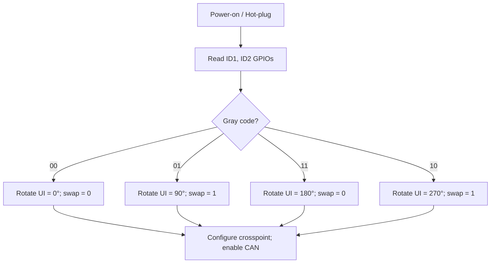

# Drimit Link – Open Standard (DL-OS 1.0)
**Version:** 1.0 · **Status:** Draft  
**Author / Organization:** [Drimit Labs](https://github.com/drimit-labs)  
**License:** [CERN Open Hardware License v2](/LICENCE)  

---

## 1 · Purpose and Scope

The **Drimit Link – Open Standard (DL-OS)** defines an **open modular connector system** based on the **CAN bus (ISO 11898-2)** for reconfigurable electronic systems—such as control surfaces, audiovisual controllers, creative workstations, and embedded modules.

This standard specifies a unified **mechanical, electrical, and logical interface** using a **reversible 3×3 pogo connector** that allows modules to dock at **0°, 90°, 180°, or 270°** without signal inversion or unsafe power polarity.

The specification is **royalty-free** and intended for use in both open-source and commercial products that maintain physical and electrical compatibility with this document.

> **Non-goals:** This standard does not define higher-layer CAN application protocols, addressing schemes, or UI semantics. Those are left to implementers.

---

## 2 · Usage

- You may use, modify, manufacture, and redistribute derivative works, provided attribution to **Drimit Labs** and compatibility with DL-OS specifications are maintained.  
- Products implementing this standard are encouraged to display:  
  `Compatible with Drimit Link – Open Standard (DL-OS 1.x)`

---

## 3 · Electrical Specification

### 3.1 Pogo 3×3 Pinout

```
Row/Col
(1,1)=NW: ID1      (1,2)=N:  ID2      (1,3)=NE: GND
(2,1)=W : S2       (2,2)=C:  V+       (2,3)=E : S1
(3,1)=SW: GND      (3,2)=S:  NC       (3,3)=SE: GND
```

| Pin | Signal | Description | Type | Voltage | Max Current | Notes |
|---|---|---|---|---:|---:|---|
| S1 | CANH | CAN high line | Diff | 2.5 V CM | — | Pair with S2 (120 Ω ±10%) |
| S2 | CANL | CAN low line | Diff | 2.5 V CM | — | Stub length ≤ 10 mm |
| V+ | Power rail | Main supply | DC | 5–12 V | 1 A avg / 3 A pk | Ideal‐diode controller required |
| GND | Ground | Common return | — | 0 V | — | Four pads tied to ground plane |
| ID1/ID2 | Identification | Orientation (Gray 2‑bit) | Digital | 3.3 V | < 1 mA | Pull‑ups/downs on baseboard |
| NC | Reserved | — | — | — | — | Reserved for future use |

> **Contact sequence:** Design pogo stack-ups so **GND pins touch first**, then **V+**, then **signals**.

### 3.2 Electrical Levels & Protection (Minimum Set)

- **Bus:** ISO 11898‑2 (High‑Speed CAN).  
- **Differential impedance:** 120 Ω ±10%.  
- **Stub length:** ≤ 10 mm from pogo to transceiver pins.  
- **ESD/EMI protection:**  
  - 1 × TVS (e.g., SM24CAN) across CANH/CANL.  
  - 1 × common‑mode choke **51–100 Ω @ 100 MHz** on CAN pair.  
  - 1 × TVS on **V+**.  
  - 1 × ferrite bead on **V+** (≥ 600 Ω @ 100 MHz).  
  - Solid GND plane beneath the CAN pair.  
- **Contact resistance (pogo):** < 100 mΩ (hard‑gold or ENIG).  
- **Hot‑plug:** Ideal‑diode + eFuse recommended (see examples).

### 3.3 Reference Protection Circuit (Per Module)

```
 V+ ──► eFuse (0.5–1 A) ─► Ideal‑diode (LM74610)
                 │
                 └─► TVS (SMCJ12A)
                   │
 GND ────────────────────────────────────────────────┐
                                                      │
 CANH ─► CMC ─► TVS (SM24CAN) ─► CAN Transceiver (MCP2562FD)
 CANL ─► CMC ─► TVS (SM24CAN) ─► CAN Transceiver (MCP2562FD)
                                                      │
                                                     GND
```

> Keep the TVS and choke **close to the pogo pads**. Match CANH/CANL lengths within **0.5 mm**.

### 3.4 CAN and Orientation Logic

Each module includes a **dual SPDT analog switch** (e.g., TI **TS5A23157** or ADI **ADG772**) to swap S1/S2 based on detected orientation:

```text
swapCAN = ID1 XOR ID2
```

**Backplane termination (ends only):** split termination recommended:

```
CANH ──60.4 Ω──┐
                │
               4.7 nF
                │
CANL ──60.4 Ω──┘──► GND
```

### 3.5 Power Distribution

- **V+ rail:** 5–12 V (typ. 12 V).  
- **Ideal‑diode controller:** mandatory per module to prevent backfeed.  
- **eFuse:** 0.5–1.5 A recommended per slot.  
- **TVS:** required on V+.  
- **Allowed drop:** < 0.25 V between modules at rated load.  
- **Copper:** ≥ 1 oz; main rails ≥ 1.5 mm width (adjust per current/length).

---

## 4 · Identification & Orientation

### 4.1 Digital Gray 2‑Bit Coding

| Orientation | ID1 | ID2 | Rotation | swapCAN |
|---|---:|---:|---:|---:|
| 0° | 0 | 0 | 0° | 0 |
| 90° | 0 | 1 | 90° | 1 |
| 180° | 1 | 1 | 180° | 0 |
| 270° | 1 | 0 | 270° | 1 |

**Implementation:** Baseboard provides fixed pull‑ups/pull‑downs (47–100 kΩ). MCU on module reads both pins and sets the crosspoint.

#### 4.1.1 Orientation Detection Flow



#### 4.1.2 Firmware Example

```c
uint8_t id1 = gpio_read(ID1);
uint8_t id2 = gpio_read(ID2);
bool swap = (id1 ^ id2);

switch((id1<<1) | id2){
  case 0b00: rotateUI = 0;   break;
  case 0b01: rotateUI = 90;  break;
  case 0b11: rotateUI = 180; break;
  case 0b10: rotateUI = 270; break;
  default:   rotateUI = 0;   /* safe default */ break;
}

set_crosspoint_swap(swap);   // TS5A23157 / ADG772
set_display_rotation(rotateUI);
```

---

## 5 · Mechanical Design

### 5.1 Overall Dimensions (25×25 Tile)

| Parameter | Value | Tolerance |
|---|---|---|
| Tile size | 25 × 25 mm | ± 0.1 mm |
| PCB thickness | 1.6 mm | — |
| Pogo grid | 3 × 3 @ 1.27 mm pitch | ± 0.05 mm |
| Magnet positions (N/E/S/W) | Ø3 × 2 mm @ R = 6.5 mm | ± 0.10 mm |
| Screw holes (M2/M2.5) | centers at ± 9.5 mm | ± 0.05 mm |

### 5.2 Alignment Magnets

- **Base:** N/S = N↑ ; E/W = S↑  
- **Module:** N/S = S↑ ; E/W = N↑  
- **Holding force:** 0.7–1.5 kgf per slot.  
- **Cavity:** Ø 3.05 × 2.05 mm (epoxy bonded).  
- **Air gap:** ≤ 0.2 mm.  
- **Back‑iron (optional):** 0.5–1.0 mm mild steel plate under magnets.  
- **Clearance to pogo grid:** ≥ 2.5 mm.

### 5.3 Screw Mounts

- Positions: (± 9.5 mm, ± 9.5 mm).  
- Holes: Ø 2.7 mm (M2.5).  
- Edge margin: ≥ 1.5 mm.  
- Fasteners: A4 stainless or brass (non‑magnetic).  
- Torque: 0.4 N·m (M2.5).  

### 5.4 Planarity & Assembly

- Total coplanarity: ± 0.05 mm.  
- Pogo protrusion: 0.05–0.10 mm above plane.  
- Magnet position tolerance: ± 0.10 mm.  
- Module pitch: 25 mm center‑to‑center.  
- **GND‑first:** Slightly longer GND pogo pins.

---

## 6 · Manufacturing & Materials

| Component | Material / Process | Notes |
|---|---|---|
| PCB | FR‑4 Tg ≥ 150 °C, ENIG finish, 1.6 mm | controlled impedance on CAN |
| Pogo pads | Hard gold ≥ 30 µin | mask‑defined pads |
| Magnets | NdFeB N35–N42 Ø3×2 mm | nickel‑plated, epoxy bonded |
| Screws | M2/M2.5 A2/A4 stainless or brass | non‑magnetic |
| Frame / housing | PC/ABS or anodized aluminum | galvanic isolation from bus |
| Protection devices | TVS, ferrites, CMC | see § 3.2 |
| Assembly | Epoxy or heat‑set inserts | ensure magnetic polarity jigs |

---

## 10 · Governance & Publication

- **Repository:** `drimit-labs/drimit-link-open-standard`  
- **Versioning:** Semantic Versioning (1.x = physical compatibility).  
- **Change proposals:** via pull requests / public RFCs.  
- **Maintainer:** **Drimit Labs**  
- **Contact:** labs@drimit.io
